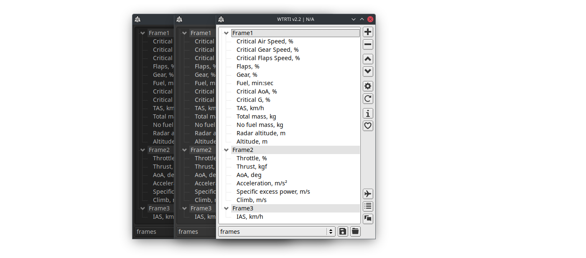
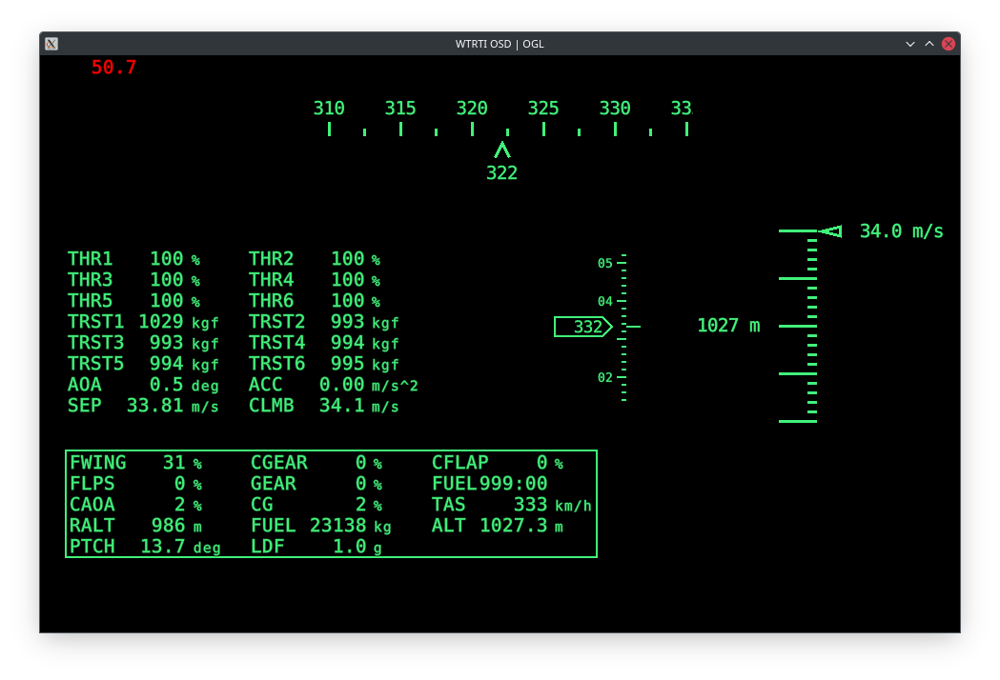
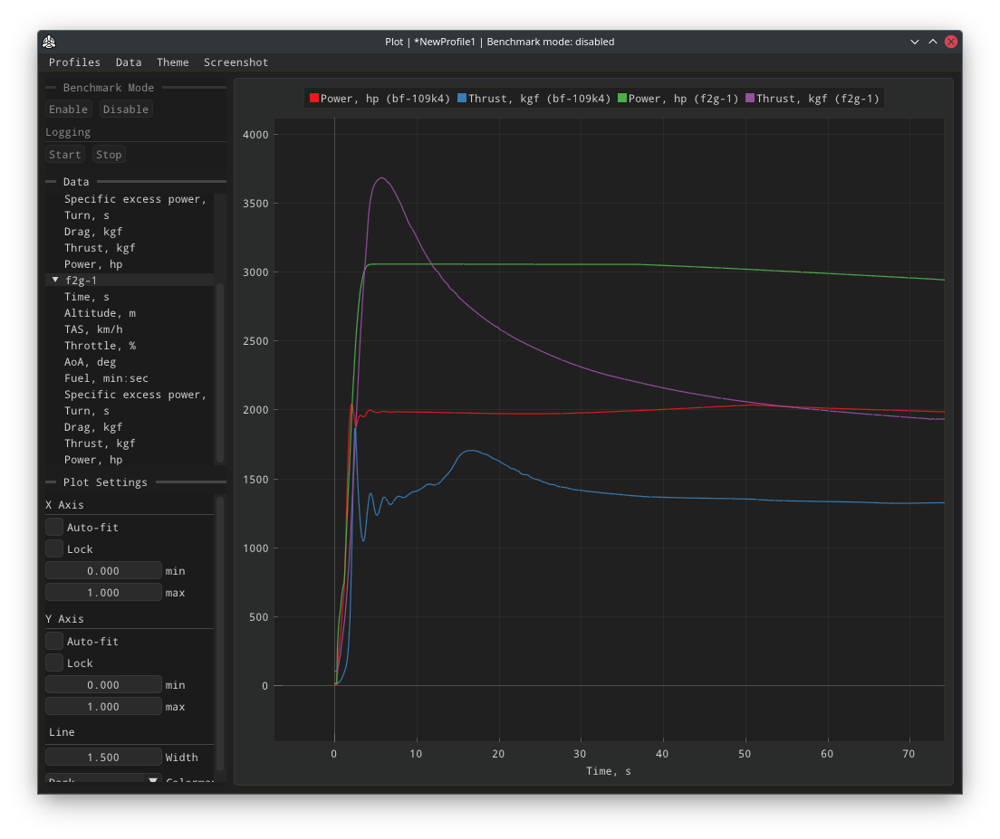

<h1 align="center">WTRTI</h1>

<h1 align="center"></h1>

<h1 align="center"></h1>

**WarThunder Real-Time Information**, a highly customizable HUD overlay and logging tool for War Thunder.    

<h1 align="center"></h1>

## Documentation
### Visit [mesofthorny.github.io/WTRTI](https://mesofthorny.github.io/WTRTI/) for more information.
