## OSD Setup
### WTRTI (Built-in)

This type of OSD is enabled by default, if it is not, you can enable it at:  
 **Settings -> OSD -> OSD Type -> WTRTI**  

Start the game. In the graphics settings, switch to **Fullscreen window** mode.  

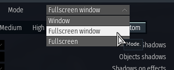

That's it. Go to the "Test Flight" for testing.  


!!! tip
    To change the font, see [Changing the fonts](features.md/#wtrti).  
!!! warning
    Make sure that **"Hardware Accelerated GPU Scheduling" (HAGS)** is **disabled**. Otherwise, it can lead to stuttering when alt-tab to the game.  
    [**How-to**](https://obsproject.com/kb/hags)  
    **Note:** If HAGS is disabled, the DLSS Framegen may not work.  

## Tooltips
Most controls have tooltips. Simply hover over them and a tooltip will appear.
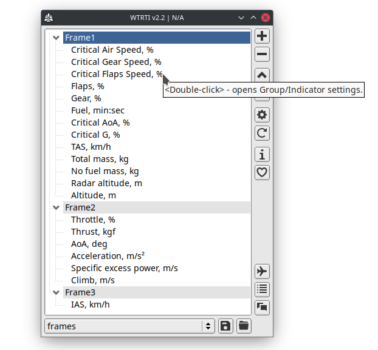


## Profiles
Profiles are located in the **Profiles** folder.  
A profile may contain: **Groups, Colors, Indicators and VR options** *(optional)*.  
All other settings are stored in the main config file (WTRTI.cfg).  
If you have downloaded a profile (.cfg file), place it in this folder and restart the application.  
You can then select it from the combo box below.  
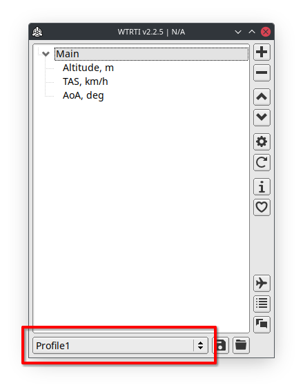

If you want to create a new profile, click the Reset button (circle arrow) in the main window.  

#### Vehicle Profiles
The type of profiles that are saved with a vehicle name, e.g. **bf-109f-4, mig_29_9_13, spitfire_mk1**.  
To save a vehicle profile, go to Test Flight then ALT-TAB to the main window, and click on the Save button (floppy disk at the bottom).  

#### Auto-loading profiles
This feature allows you to automatically load profiles when you start a battle or change vehicles.  
You can enable it at: **Settings -> General tab -> Auto-load profiles**  
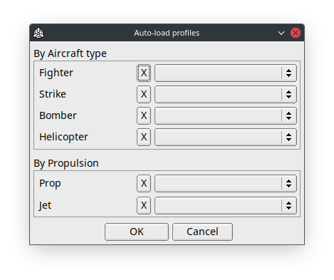

Profiles have loading priorities:  
1. Vehicle Profiles.  
2. By a Type: Fighter, Strike, etc.  
3. By a Propulsion: Prop, Jet.  
This means that if you have a vehicle profile, it will be loaded first, ignoring other types.  

#### Loading profiles by Hotkeys
Only works while in the battle.  
**Settings -> Hotkeys tab -> Loading profiles**
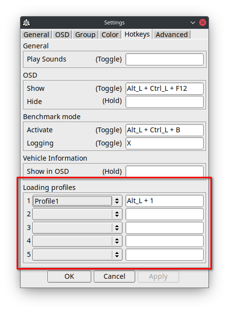


## Groups
Groups controls how the indicators are displayed, their position and layout.  
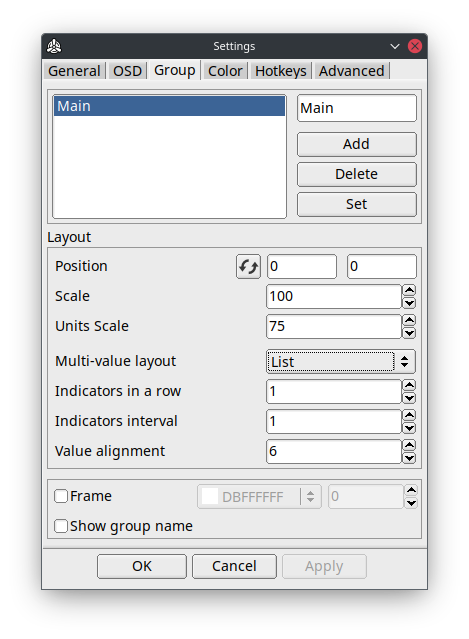
!!! tip
    To quickly access this settings, double-click on a group (e.g. "Main") in the main window.  

You can also move a group using keyboard.   
Select a group in the main window, **ALT-TAB** to the game and press:  
**SHIFT + ALT + ARROWS**

#### Setting up Multiple Groups
This feature allows you to configure multiple groups at the same time.  
Select multiple groups from the Groups list, make changes, and click Apply.  
Only the changed settings will be applied to other groups.  
You can also move multiple groups at once.  
If you change the position of the leading group (the last one selected), the leading group's offset (new - old pos) will be applied to the others.  

#### Multi-value layout
This option allows you to change the layout of neighboring multi-value indicators.

- **List**:  ENGN1, ENGN2, ENGN3, RPM1, RPM2, RMP3, etc
- **Shuffle**:  ENGN1, RPM1, ENGN2, RPM2, ENGN3, RPM3, etc

## Colors and Color Schemes
WTRTI works with color slots.  
You can **Add**, **Delete** and **Set** a color slots (maximum 32).  
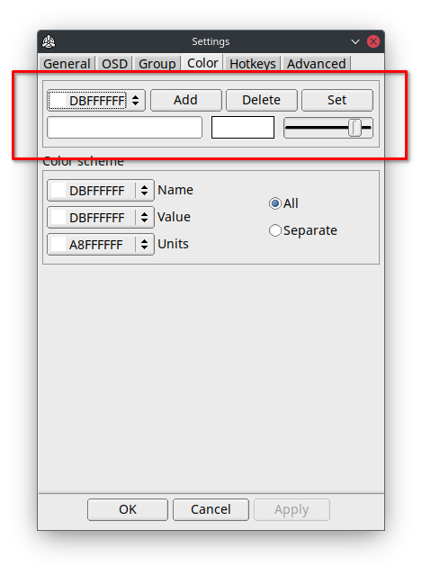

By default, all indicators have the same color scheme (All).  
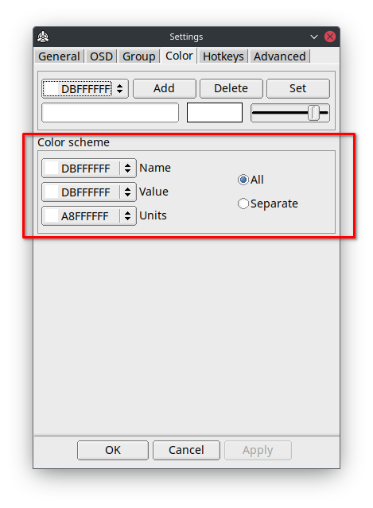

You can change the color for every part of an indicator: Name, Value, Units.  
If you want to set up colors for a specific indicator, enable the **Separate** Color scheme, then you can change the colors in the indicators settings.  
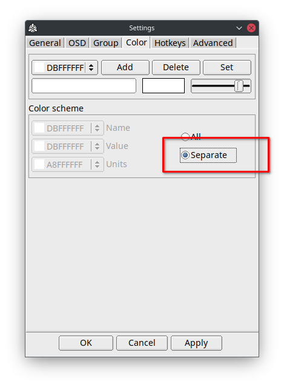
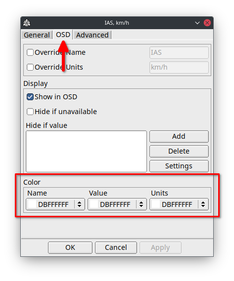

## Indicators
**Double-click** on the indicator in the main window to open the indicator settings window.

### General
#### Alert
Alerts, allows you to specify a range of values within which you will be alerted visually (color change) or sound playback when the value exceeds the threshold.  

For example, you need an alarm when you are at low altitude.  
Open the "Altitude, m" settings.  
Add a new alert condition by clicking the Add button in the Alert section.  
Then double-click on the new element.  
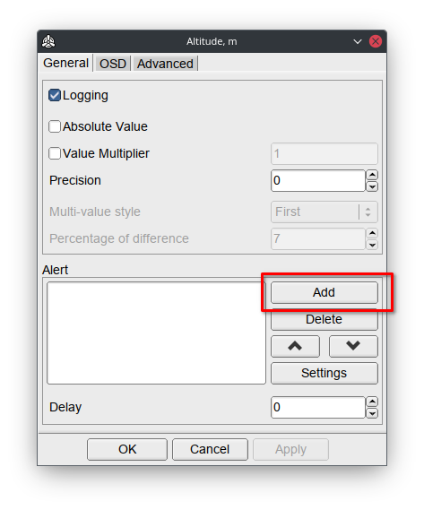

Specify the threshold value (e.g 200 meters)  
**Note:** Using **<** sign means that this condition will only be triggered for values below 200.  
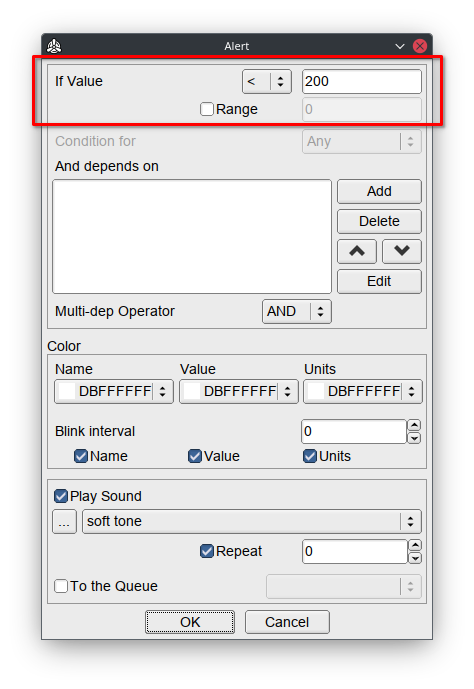

Choose a color and sound.  
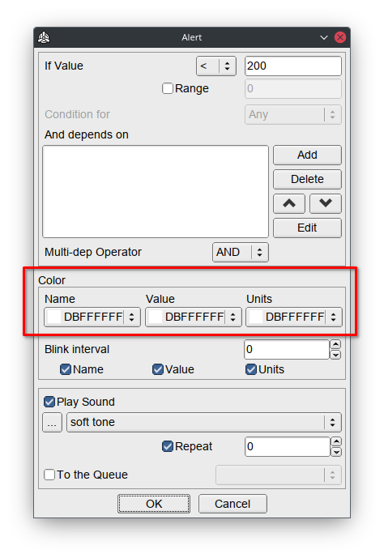

Click on the OK button.  
This is it. Go to Test Flight for testing!  

!!! note
    Multiple conditions are checked from top to bottom.  
    Only the **last** matched condition will be triggered.  

!!! tip
    **"min:sec"** indicators are set in seconds.  

!!! tip
    For sound alerts, it's recommended that you use a 'relative paths' for audio files by selecting them from the WTRTI root directory, e.g. **Sounds** folder.  
    This makes the profile more portable, so you can share it with others.
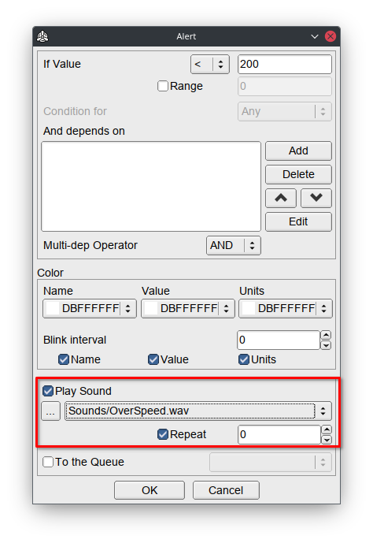

### Advanced
#### In "State" list
This option allows you to place the final value of the indicator, after all postprocessing, into the "State" list (press **F2** in the main window).  
Enable the option and specify the **key** that will be in this list.

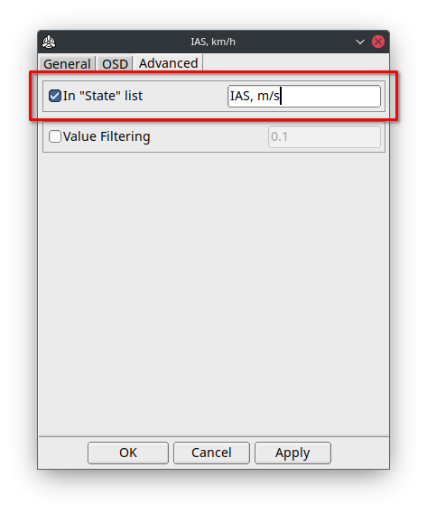

All In-State indicators are calculated in a separate order, from top to bottom, before Non-In-State indicators.  
The indicator with an in-state key that depends on another in-state indicator (chained), must be placed below that indicator in the main list, otherwise it will be **N/A**.  


## Logging the data to a CSV file
1. Go to Test Flight.
2. Activate **Benchmark mode** with **CTRL + ALT + B** (by default).
3. To start logging press **X** key.
4. Press again **X** to stop.

All these hotkeys you can rebind in the **Settings -> Hotkeys tab**.  
You can change the logging interval in milliseconds, at  
**Settings -> General tab -> Benchmark mode -> Logging Interval**  
Generated .CSV files are located in the **Logs** folder.   
When importing to Excel, select **"Comma"** as Delimiter(Separator).  

In the OSD, the benchmark information is positioned in the last group, so if you want to place it in a specific location, create an empty group and move it as you wish.  

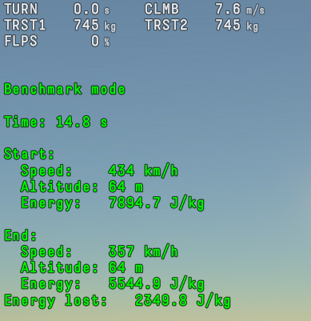
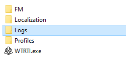

You can toggle `Logging` for a specific indicator in the **Indicator's Settings**, by default it's enabled.
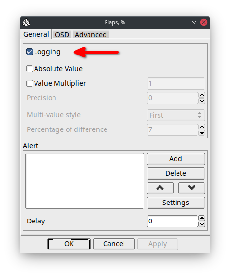

## Game Chat
Game chat - allows you to see, copy or translate messages of the in-game chat.  
You can enable the auto-logging feature, **Game Chat** -> **Settings** -> **Logging**, this will automatically write into a log file for every game session.  
Log files are located in the **Logs** folder.  
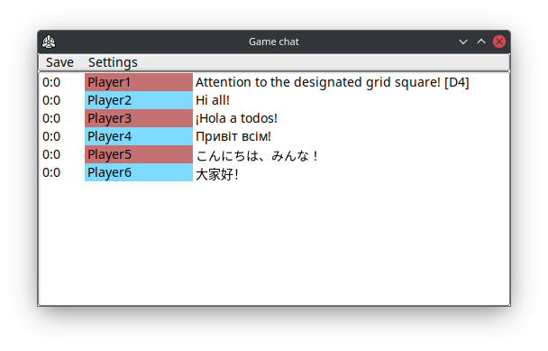


## Battle Log
Shows recorded battle events, with ability Logging to file.  
You can enable the auto-logging feature, **Battle Log** -> **Settings** -> **Logging**, this will automatically write into a log file for every game session.  
Log files are located in the **Logs** folder.  
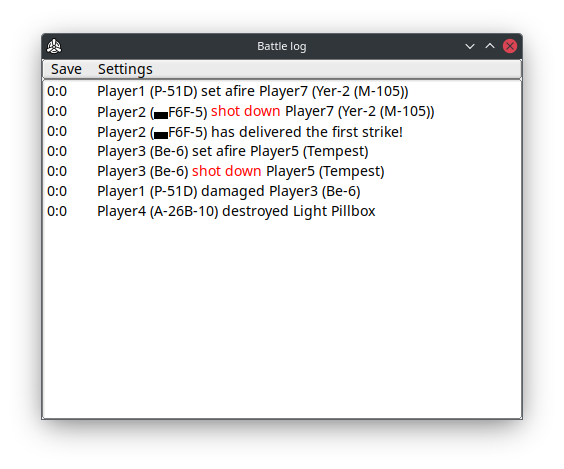

#### Highlights
Located at Battle Log -> Settings. Allows you to set a "keywords" to highlight certain words in battle log messages.  
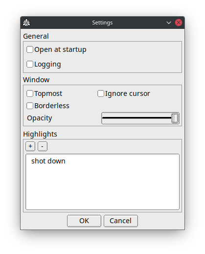

## Vehicle Information
This window allows you to see some information about your current/selected vehicle.  
!!! warning
    This information depends on the pre-generated **offline** database.  
    **Please do not use it for bug reports!**

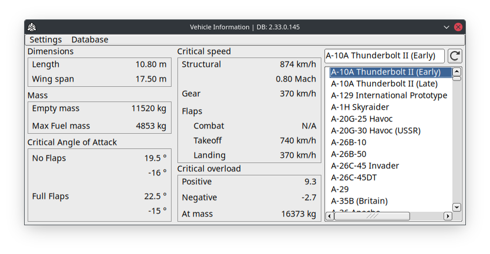

You can also see this information in the overlay.  
All you need is to set up a hotkey at:  
**Settings -> Hotkeys tab -> Vehicle Information -> Show in OSD**  

## VR

### Setup
1. Start **SteamVR**.
2. Start WTRTI and enable **VR mode** (**Settings -> Advanced tab**).
3. Go to the "Test Flight".
4. Resize the "WTRTI OSD" window to make indicators visible.
5. Enable "HMD Tracking" with a hotkey (**CTRL + ALT + V**) or in the app **VR Settings -> Tracked device**.
6. Attach the overlay in space using hotkey **CTRL + ALT + S**.

!!! tip
    Click on the **VR** button in the main window to display the **VR Settings**.

!!! warning
    If you have an **iGPU**, make sure you are using WTRTI on the discrete GPU (High performance):  
    <https://pureinfotech.com/set-gpu-app-windows-10/>

### Hotkeys
- **CTRL + ALT + V** - toggles "HMD tracking" mode.
- **CTRL + ALT + Z** - toggles "Left controller tracking" mode.
- **CTRL + ALT + X** - toggles "Right controller tracking" mode.
- **CTRL + ALT + S** - attaches the overlay in space ("None" tracking mode).
- **SHIFT + ALT + R** - resets the overlay position and rotation(x:0.0, y:0.0, z:-0.5).
- **SHIFT + ALT + LEFT/RIGHT** - moves the overlay along the X axis.
- **SHIFT + ALT + UP/DOWN** - moves the overlay along the Y axis.
- **SHIFT + ALT + PAGE UP/PAGE DOWN** - moves the overlay along the Z axis.
- **SHIFT + ALT + Q** - reduce overlay size.
- **SHIFT + ALT + E** - increase overlay size.

### SteamVR Controller Bindings support
Allows you to assign VR controller buttons to specific WTRTI actions.  
To make the settings available in SteamVR, you first need to go to "Test Flight" and then select WTRTI from the list of programs in the SteamVR Controller Bindings window.  

### Meta/Oculus headsets
Make sure that the **Current OpenXR Runtime** is **SteamVR**.  
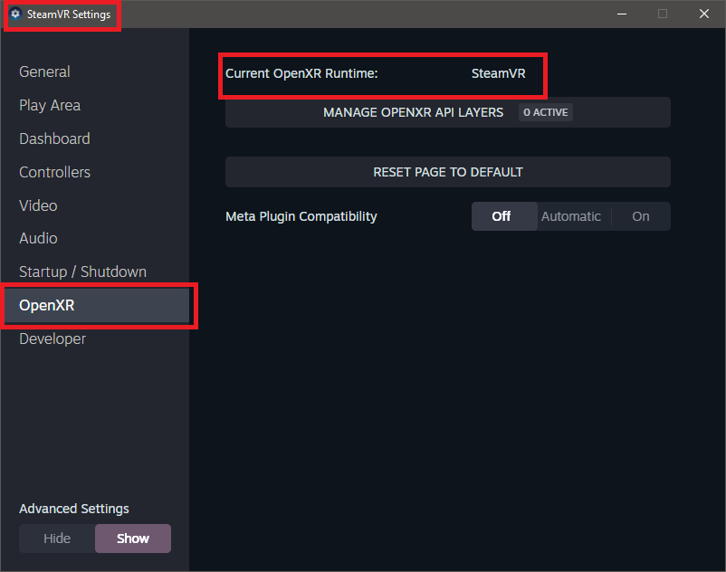

### Meta/Oculus headsets (Legacy)
To make the game run through SteamVR, you have to set the compatibility mode to Windows 7, for **aces.exe** in win32 and win64 folders.  
How-To:  
In the game root folder, open **win32** folder and find **aces.exe**, open its **Properties** and set **Compatibility mode** to Windows 7:  
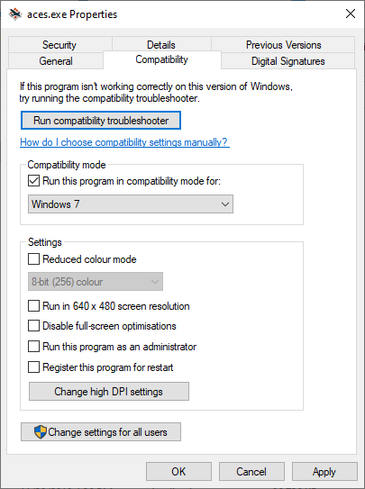

Do the same for aces.exe in the win64 folder.  
It is also recommended to run the game through Steam.  


## Advanced
### RTSS OSD Setup
1. [Download](https://www.guru3d.com/files-details/rtss-rivatuner-statistics-server-download.html) and Install RTSS.
2. Start WTRTI.
3. **Settings -> OSD -> OSD Type -> RTSS**
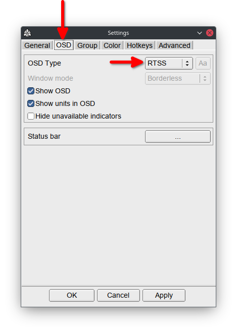

!!! note
    By default RTSS has **2x** "On-Screen Display zoom".  
    If you do not change it to 1x, the position of a group in WTRTI will be magnified by 2.  
    For example, 200,100 in config becomes 400,200 on screen.  

!!! warning 
    RTSS **only** works with text-based indicators.  
    Also, RTSS only supports **ASCII** characters.

To change the font, see [Changing the fonts](features.md/#rtss).

### Gamescope Setup (Linux)
There are two ways to use gamescope:

##### Create a script:
```
#!/bin/bash
export PATH=$PATH:/path/to/WTRTI
./launcher &
WTRTI
```
Place it in the game root directory, where the launcher is, and run it with Gamescope:  
`gamescope ./run.sh`

##### From command line:
1. Start the game with Gamescope:  
   `gamescope ./launcher`
2. Launch WTRTI from another command line:  
   `GAMESCOPE_DISPLAY=:2 ./WTRTI`

!!! note
    **GAMESCOPE_DISPLAY** should be the name of the gamescope Xwayland server.  
    When you start the game with gamescope, you can see what name gamescope uses.  
    `wlserver: [xwayland/server.c:108] Starting Xwayland on :2`

!!! warning
    Before closing the game, close WTRTI first and then the game!  
    Otherwise the app will crash and you may lose your configuration.  

### FM Mode
This mode contains additional indicators, that **only** works in "Test Flight":  

- Excess power, W
- Drag, kgf (lbf)
- Total mass, kg (lb)
- No fuel mass, kg (lb)
- Thrust to Weight ratio
- Critical G, % (in-battle approximate version)

To make these indicators to work, follow these steps:  

1. Open the game root folder.
2. Open **config.blk** file with text editor.
3. Find `debug` section
4. Emplace this line:
```
enableFMCommands:b=yes
```
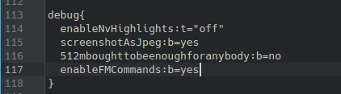  
5. Save the file and Start/Restart the game.
6. Start WTRTI and enable **FM mode** in **Settings -> Advanced**.


### Custom indicators
Open **Add** window (**+** button) -> **New** (or **RMB** on the indicators list).  
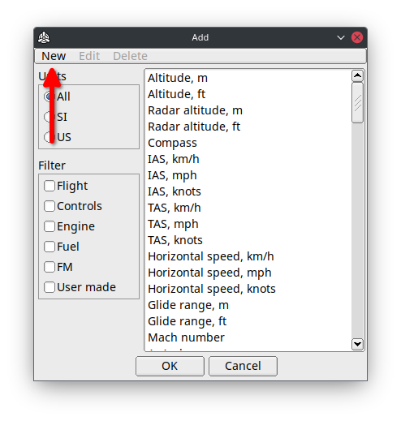
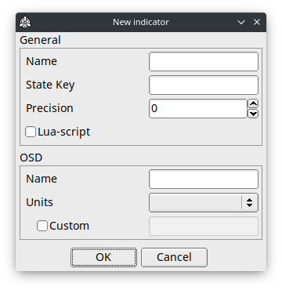

Use **State** window(press **F2** in the main window) to see which parameters are available.  
!!! warning
    Empty **State Key** - switches the indicator into "label" mode, which will only show OSD name and trigger an alerts.  

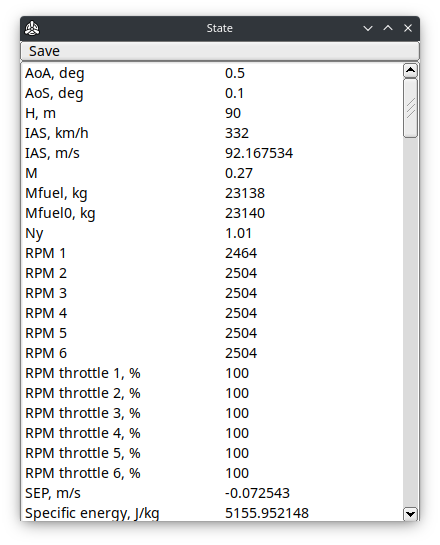

#### Multiple values
Replacing numbers in the **State Key** with `%d`, allows reading multiple parameters (e.g. multiple engines) with the same key.  
Examples:  
**`RPM 1`** -> **`RPM %d`**  
**`manifold_pressure1`** -> **`manifold_pressure%d`**  

#### "Lua-script" option
Allows you write a custom value processing in Lua.  
Right after enabling this option and pressing OK, a template script will be created, you can find it at:  
**`Indicators/<NAME>/update.lua`**  

Also have a look at the [Lua API](lua-api.md) to see all the functions that are available.  

## OSD on a second screen
Simply switch "Window mode" (Settings->OSD) to "Windowed" and move the "WTRTI OSD" window to a second screen.
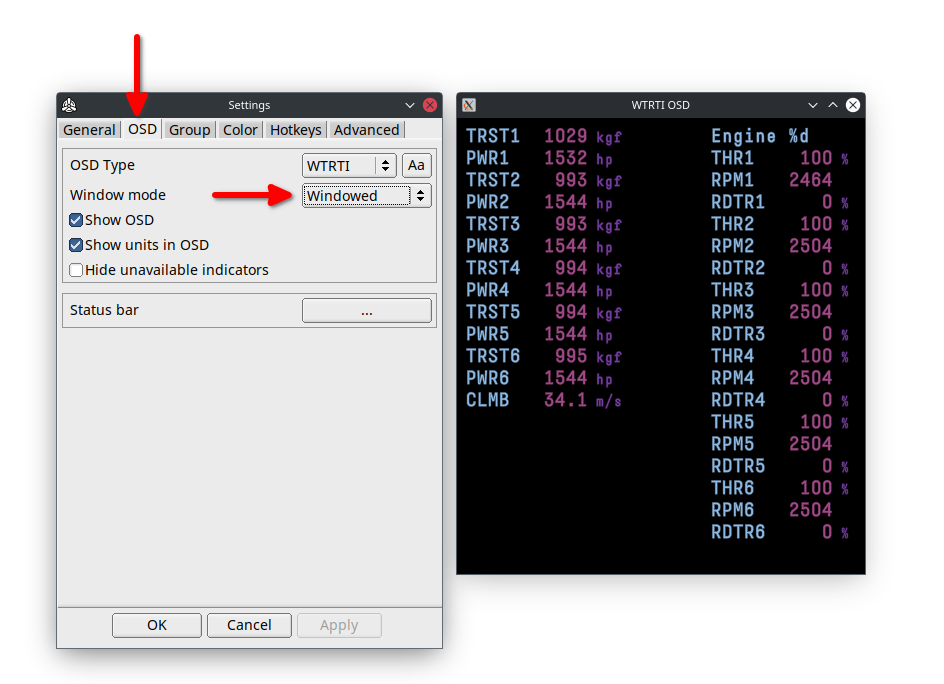

## Receive data from another PC or Console on the local network
Set another PC's **local** IP address in **Settings** -> **Network** -> **Address**:
!!! warning
    Leave **`8111`** port unchanged

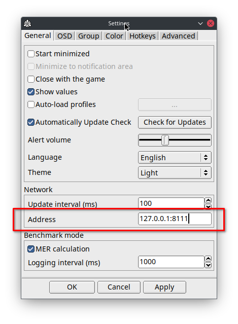

## DCS World Setup
1. Copy the files from **DCS** folder (in the app root folder) into  
   **`%USERPROFILE%\Saved Games\DCS\Scripts\`**  
   For **Open Beta**:  
   **`%USERPROFILE%\Saved Games\DCS.openbeta\Scripts\`**  
2. Open the **Scripts** folder and rename **Export.lua.inc** -> **Export.lua**  
> Note: If you already have Export.lua, simply copy the internals of Export.lua.inc into Export.lua.  
3. Start WTRTI, open **Settings -> Advanced tab -> Enable "TCP Listener"**.  
4. Start the game.  

### Multiplayer
##### Hosted server
Check if the server has these options in the DCS World multiplayer lobby window:

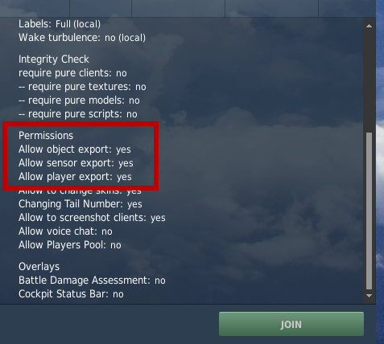

##### Creating a Server
Click on **Advanced** and enable these options:

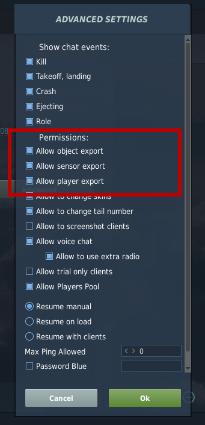


## Changing the fonts
### WTRTI
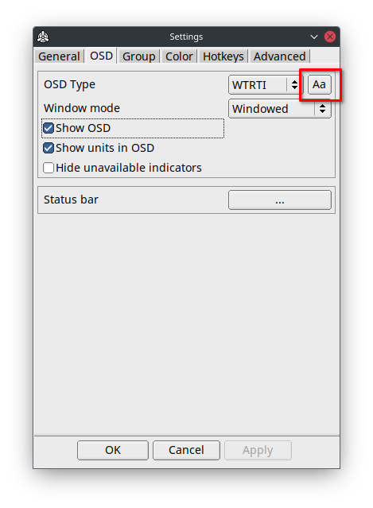
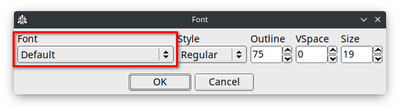

!!! tip
    You can use a custom font file.  
    Simply place a TTF file into **Fonts** folder and select it in Settings.

### RTSS
Start RTSS and click on "Raster 3D" button.  
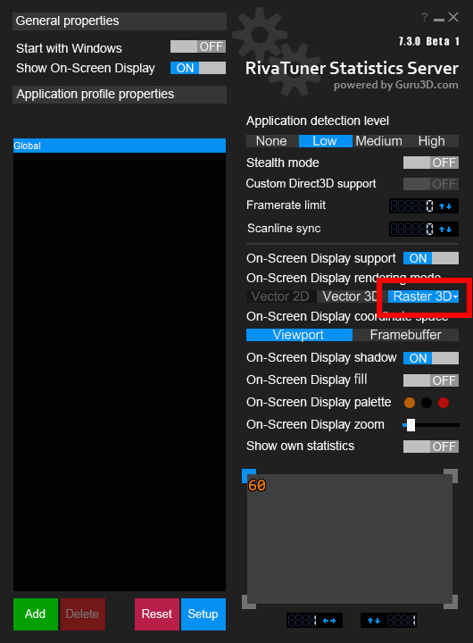
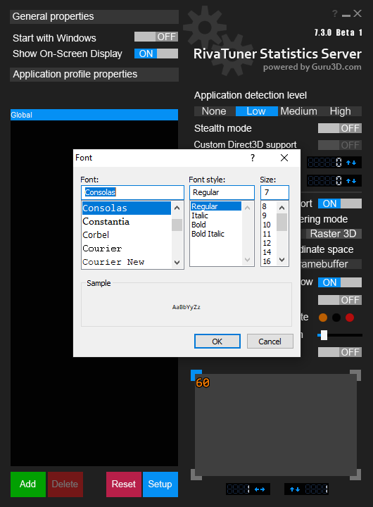

!!! tip
    Use monospace fonts for better layout.

!!! tip
    In order to use custom font files, you will need to install them on your system.

