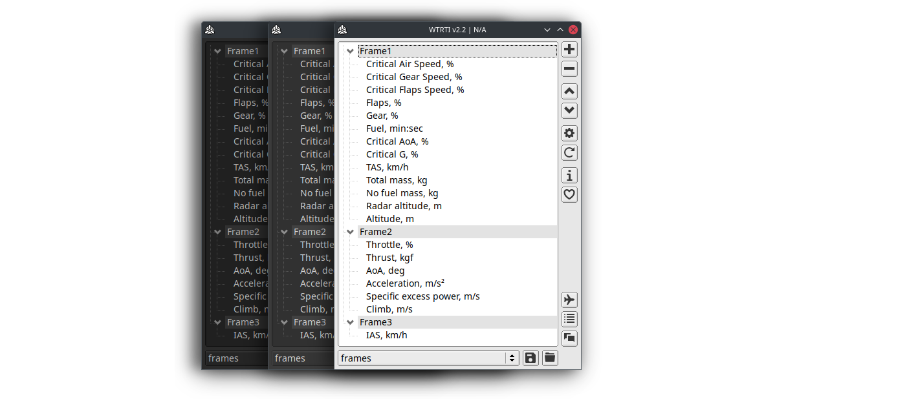
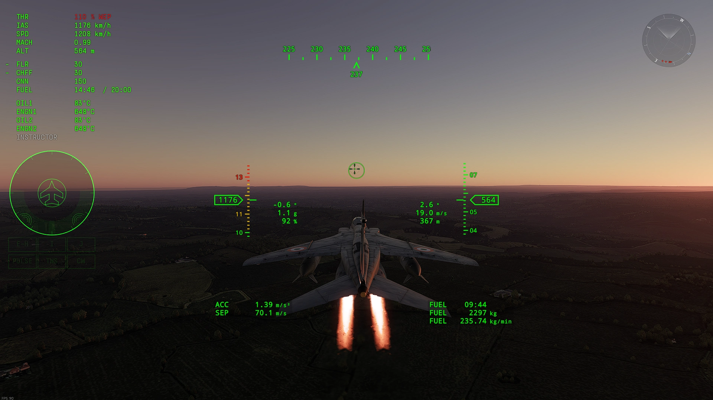
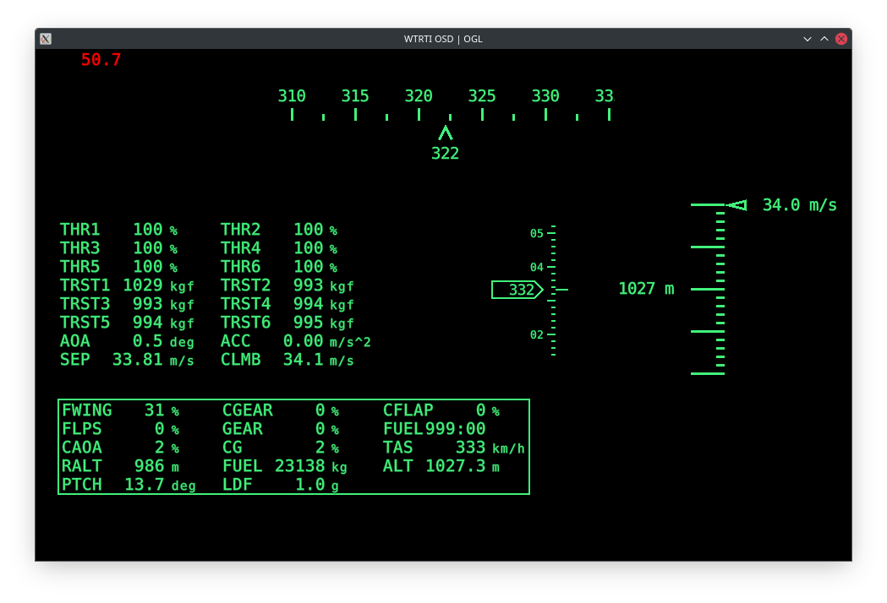

# Welcome to WTRTI

**A highly customizable HUD overlay and logging tool for War Thunder.**  

_PRO version HUD:_

[Download](https://github.com/MeSoftHorny/WTRTI/releases/latest/){ .md-button .md-button--primary }
[PRO Version](https://patreon.com/wtrti/about){ .md-button .md-button--primary }

## Features
- **Cross-platform**: Windows, Linux and macOS.
- **VR support** (SteamVR only). See [VR section](features.md/#vr).
- **Graphical indicators**. [PRO version](https://patreon.com/wtrti).
- More than 30 types of indicators (Climb, AoA, Turning time, Fuel consumption, WEP timer, Booster remain, Critical Speed, Critical AoA etc.).  
  **Note:** **Weapon** or **Ammo** information **is not** available (or very limited) in the web-map, so it cannot be added to the app.  
- Two types of OSD (On-screen display):  
    - **WTRTI** - Built-in OSD. See [OSD Setup](features.md#wtrti-built-in).  
    - **RTSS** - using "RivaTuner Statistics Server" OSD functionality. See [RTSS OSD Setup](features.md#rtss-osd-setup).  
- **Vehicle Information** window, provides additional information (Speed Limits, Critical Overload, Critical AoA, etc).
- **Custom indicators**, allows you to make a new indicators with a specific reading properties from the game.
- **Customizable "Alert" conditions**, with a sound playback. See [Alert](features.md#alert).
- **Lua** scripts, for custom processing of indicator values.
- **Plot** window that provides real-time visualization of telemetry data on a graph.
- **Logging** of the flight data in a [CSV file](features.md#logging-the-data-to-a-csv-file).
- **Per-vehicle profile**, with automatic loading at the beginning of a battle.
- **Hotkey actions** (e.g. Profile loading, OSD visibility, VR).
- **Game chat** window, with ability translate in-game chat messages by opening Google Translate web-page or 'in-app' translate ([Lingva.ml](https://lingva.ml)).
- **Battle log** window, with a keyword highlight of the battle events.
- **DCS World** support *(Experimental)*, see [DCS World Setup](features.md#dcs-world-setup).

## How it works
This is **not** a mod.  
WTRTI does **not** make any changes to the game process or its data, it takes the game telemetry data (official API) and displays it on a screen (Overlay).

## Installation
1. Download [**the latest version**](https://github.com/MeSoftHorny/WTRTI/releases/latest).
2. Extract it to a separate folder with **write permissions**.  
!!! warning
    Make sure it is not in the game root directory, otherwise the game launcher will delete the WTRTI executable.  
!!! tip
    Since the program works in **portable mode**, all files (logs, profiles, etc.) that the program dumps or uses, will be located in the same folder as the executable file.  
    As an exception on **Mac**, the config folder is located at: `~/Library/Application Support/WTRTI/`  
3. Start WTRTI.
4. Add some indicators to the list (**+** button).
5. Start the game and switch to the "**Fullscreen Window**" mode in the **Graphics** settings.  
> **Note:** If the overlay freezes/stutters, try disabling the **"Hardware Accelerated GPU Scheduling" (HAGS)**. [**How-to**](https://obsproject.com/kb/hags)  
6. Go to "Test Flight".
!!! tip
    Use [Groups](features.md/#groups) to change position or layout of indicators.  

### Upgrade from old versions
Simply extract the downloaded zip file into the folder where the old version is located.

## System requirements
- **Game**: **Full client+**  
> **Note:** **"Custom Battles"** or **"Custom Difficulty"** (Test Flight): Requires enabled **"Allow web UI"** option.  
> **Note:** **DEV Server** or **Minimal client** users, see [Troubleshooting](troubleshooting.md#not-working-with-dev-server) for a workaround.  
- **OS**:  
  **Windows**: 7+.  
  **Linux**: Ubuntu 20.04 and later. X11 only.  
      *The Overlay requires Compositor (eg. kwin, compiz).*  
      *Recommended to use __Gamescope__(v3.11.0+) for better performance. See [How-To](features.md/#gamescope-setup-linux).*  
  **macOS**: 11.0 and later. See `Docs/MACOS_README.txt` in the zip file.  
- **Graphics**:  
  Buit-in OSD: Any OpenGL 3.3 compatible GPU.  
  *RTSS OSD: Rivatuner Statistics Server v7.3+. [Download](https://www.guru3d.com/files-details/rtss-rivatuner-statistics-server-download.html)*
- **VR**: SteamVR. See [VR section](features.md/#vr) for more info.
